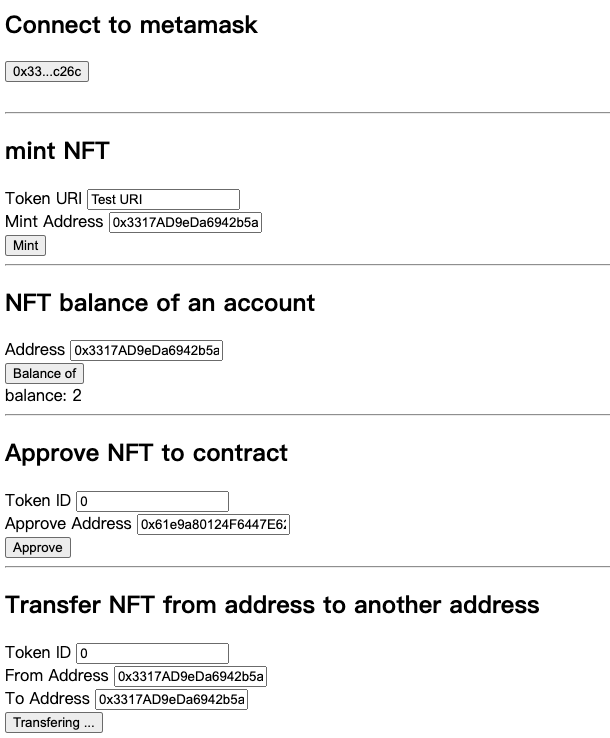

# NFTmovie_web3
基于BSC testnet搭建了NFTmovie前端的web3接口，主要和Movie（ERC721）合约交互，实现了mint，balanceOf, approve, transferFrom功能。之后迁移到QTUM，并实现买，卖功能（目前买卖NFT的合约还不清晰）。

1. Movie合约部署在BSC testnet：0x61e9a80124F6447E62E7812A0DE793a1f7c42e4D。因为还不能连接到qtumjs，之后再迁移到qtum。
2. 可以Mint NFT， 查询余额，approve，转移NFT。

截图：

